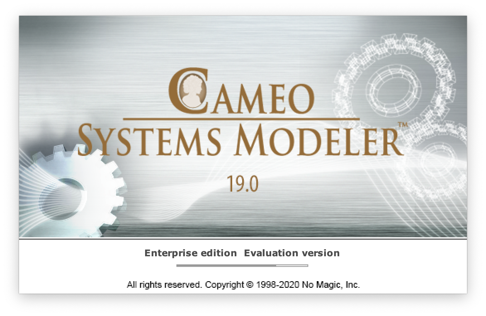

# Base de la Conception Orientée-Objet 2020
TD/TP 2020 du cours de BCOO (M2105)

## Identification
:warning: Remplacer vos nom/prénoms/groupe dans ce qui suit :

### NOM : DOE
### Prénom : John
### Groupe de TP : 
- [x] 1
- [ ] 2
- [ ] 3
- [ ] 4

## Consignes

1. Modififiez les infos ci-dessus vous concernant
2. Ouvrez le TD du jour (exemple le `TD2`) sur le lien du cours : http://iut-blagnac.github.io/POO/
3. Ajoutez un fichier correspondant à votre réponse à une question (exemple pour la question 2.3 => `TD2.2.3.plantuml`)
4. Quand vous estimez avoir fini, indiquez en message du "commit" associé un message de la forme :
```
Fix #2.2.3: diagramme de classe de la voiture
```


